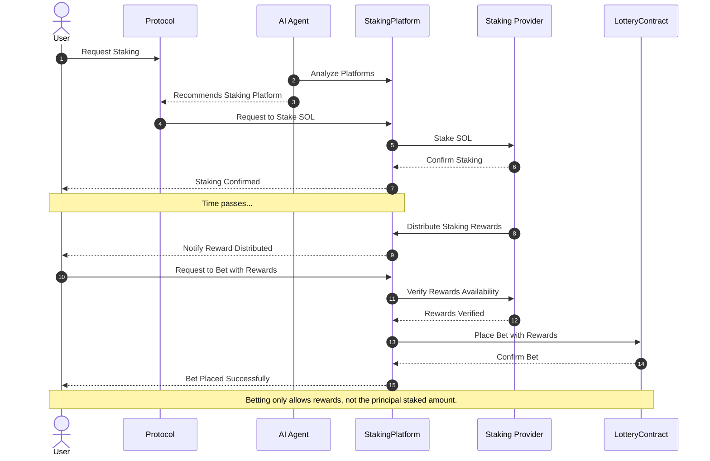
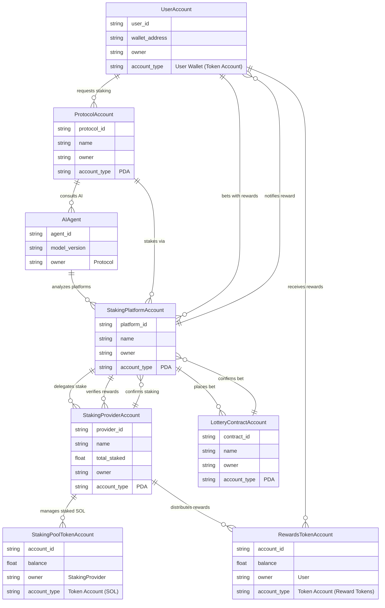

# Capstone project - TURBIN3 Q1 2025

Capstone project for Turbin 2025 Q1

[LOI](https://docs.google.com/document/d/1RnwgPXAF4HwqqXloj5LX-fdnMdOWr92yRmsojCze8H4/edit?tab=t.0)

## Front End

TBD

## Sequence Diagram

## ER

## interaction diagram

```mermaid
graph TD

%% User Interaction Flow
  User(User) -->|Deposits SOL| DepositProcess
  DepositProcess --> StakingPlatform(Staking Platform)
  StakingPlatform -->|Confirms Deposit| User

  User -->|Requests Staking| StakingProcess
  StakingProcess --> StakingPlatform
  StakingPlatform --> StakingProvider(Staking Provider)
  StakingProvider -->|Stake Confirmed| StakingPlatform
  StakingPlatform -->|Notifies User| User

  User -->|Claims Rewards| RewardClaiming
  RewardClaiming --> StakingPlatform
  StakingPlatform --> StakingProvider
  StakingProvider --> RewardsTokenAccount(Rewards Token Account)
  RewardsTokenAccount -->|Tokens Transferred| User

  User -->|Bets with Rewards| LotteryProcess
  LotteryProcess --> StakingPlatform
  StakingPlatform -->|Verifies Reward Balance| StakingProvider
  StakingProvider -->|Confirm| StakingPlatform
  StakingPlatform --> LotteryContract(Lottery Contract)
  LotteryContract -->|Bet Confirmed| User

%% Program Interaction Matrix
  StakingPlatform -->|Cross-Program Call| StakingProvider
  StakingPlatform -->|Cross-Program Call| LotteryContract
  LotteryContract -->|Control Flow| StakingPlatform
  StakingProvider -->|Data Transmission| StakingPlatform
  StakingPlatform -->|Data Transmission| LotteryContract

%% Account Management
  User -->|Creates| UserAccount(User Account)
  StakingPlatform -->|Manages| StakingPlatformAccount
  StakingProvider -->|Manages| StakingPoolTokenAccount
  StakingProvider -->|Updates| RewardsTokenAccount
  User -->|Transfers Ownership| MultiSigVault(Multi-Sig Vault)

%% External Integrations
  StakingPlatform -->|Compliance Check| ComplianceProvider(Compliance Provider)
  StakingPlatform -->|Fetch Stake Data| StakingProvider
  User -->|Withdraws to Vault| MultiSigVault
  MultiSigVault -->|Security Check| ComplianceProvider
  ComplianceProvider -->|Approval| MultiSigVault
  MultiSigVault -->|Executes Transfer| User

%% Legend
  classDef userNode fill:#f9f,stroke:#333,stroke-width:2px;
  classDef contractNode fill:#9ff,stroke:#333,stroke-width:2px;
  classDef processNode fill:#ff9,stroke:#333,stroke-width:2px;

  class User,UserAccount,MultiSigVault userNode;
  class StakingPlatform,StakingProvider,LotteryContract,ComplianceProvider,Oracle contractNode;
  class DepositProcess,StakingProcess,RewardClaiming,LotteryProcess processNode;
```

